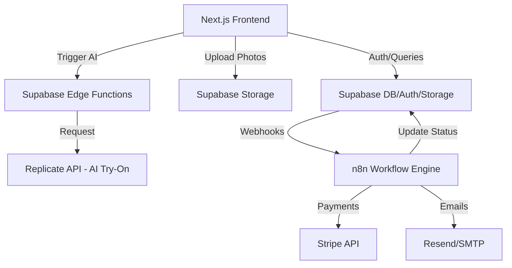
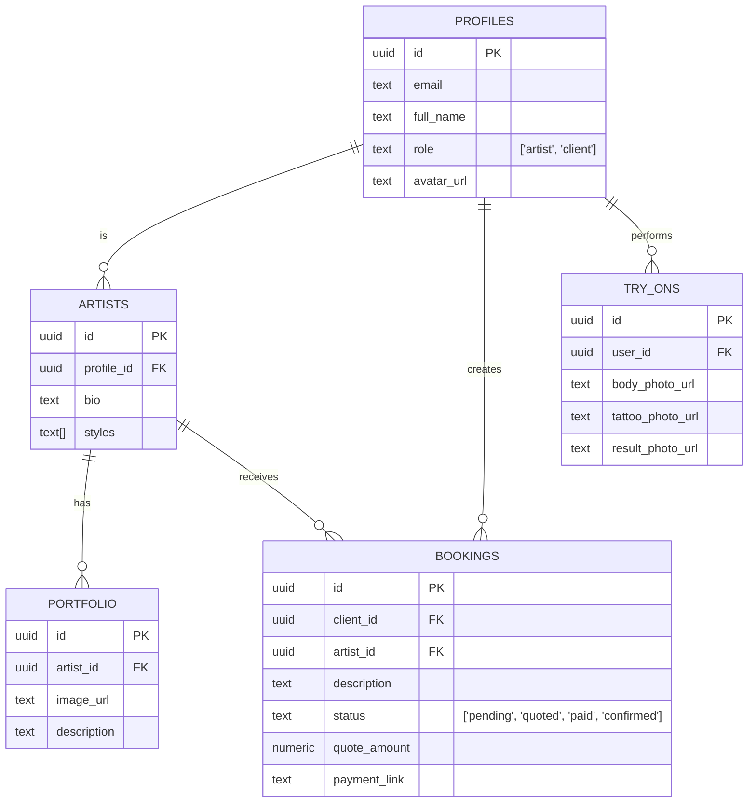

# Architecture: InkMatch

## System Overview
InkMatch is a full-stack web application built with Next.js and Supabase. It uses n8n for workflow automation (booking states) and external AI APIs (Replicate/OpenAI) for the tattoo visualization feature.

## Component Diagram

## Tech Stack
| Layer    | Technology | Why |
|----------|-----------|-----|
| Frontend | Next.js (App Router) | React framework for SEO, SSR, and fast DX. |
| Backend  | Supabase | All-in-one Auth, DB (Postgres), and Storage. |
| Logic    | Edge Functions | Serverless logic for AI API calls. |
| Automation| n8n | Visual workflow for complex booking logic. |
| AI       | Replicate (ControlNet/SD) | Specialized models for image-to-image/overlay. |
| Styling  | Vanilla CSS / Modules | Clean, performant, and flexible styling. |

## Data Model

## API Design
- **Auth**: Supabase Auth (Implicit).
- **Edge Functions**:
    - `POST /generate-tryon`: Orchestrates the AI image generation.
- **n8n Webhooks**:
    - `POST /webhooks/payment-success`: Updates booking status after payment.

## Integrations
| Service | Purpose | Protocol |
|---------|---------|----------|
| Replicate | AI Tattoo Overlay | REST (via Edge Function) |
| Stripe | Deposit Payments | Webhooks / Redirect |
| Resend | Booking Notifications | REST (via n8n) |

## Quality Attributes
- **Performance**: AI generation < 15s. Page load < 1.5s.
- **Security**: RLS (Row Level Security) on all Supabase tables. Only artists see their own bookings.
- **Reliability**: n8n handles retries for external service failures.

## Key Decisions
- **n8n over Edge Functions for Booking**: Booking logic is a state machine that involves waiting for human input (Artist quote) and external events (Payment). n8n is better suited for these long-running, visual workflows.
- **Supabase Storage for Images**: Natural fit given the use of Supabase for the DB; simplifies permission management.
